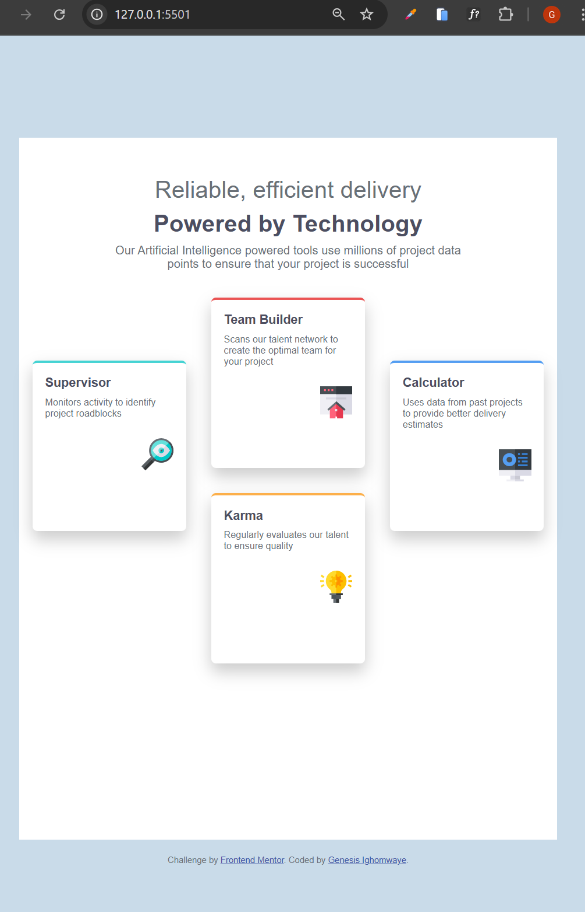

# Frontend Mentor - Four Card Feature Section

This is my solution to the [Four card feature section challenge on Frontend Mentor](https://www.frontendmentor.io/challenges/four-card-feature-section-weK1eFYK).

## 📸 Screenshot

 

---

## 🔗 Links

- Live Site URL: [Add your live site here](https://your-deployment-link.com)

---

## 🛠 Built With

- Semantic HTML5
- CSS3 (Flexbox + Grid)
- Custom media queries
- Google Fonts (`Poppins`)
- Mobile-first responsive design

---

## 📐 Layout

The layout uses a combination of **CSS Grid** and **relative positioning** to form a diamond-shaped structure on desktop, with responsive stacking on smaller screens.

---

## ⚙️ Features

- Fully responsive layout (mobile-first)
- Visually distinct card design with colored top borders
- Diamond card arrangement on desktop
- Optimized for 600px and 900px breakpoints

---

## 📚 What I Learned

- How to create a diamond-shaped grid layout using `grid-column`, `grid-row`, and `position: relative`
- How to reset layout behavior in media queries using `grid-template-columns: 1fr` and `position: static`
- Using `vh` and `rem` units for responsive height and spacing
- How to visually hide a ` ` tag using a `` wrapper and `display: none` in media queries
- Customizing box shadows and borders to visually distinguish elements

---

## 🔄 Continued Development

- How to use CSS animations and transitions.
- To make the responsiveness of my pages better

---

## 🧠 Useful Resources

- [CSS Grid Guide – MDN](https://developer.mozilla.org/en-US/docs/Web/CSS/CSS_Grid_Layout)
- [Responsive Units – CSS Tricks](https://css-tricks.com/the-lengths-of-css/)
- [Google Fonts – Poppins](https://fonts.google.com/specimen/Poppins)
- [Frontend Mentor Challenge Page](https://www.frontendmentor.io/challenges/four-card-feature-section-weK1eFYK)

---

## 👤 Author

- GitHub – [@genesiswaye]https://github.com/genesiswaye/Frontend-mentor-submissions.git
- Frontend Mentor – [@genesiswaye](https://www.frontendmentor.io/profile/genesiswaye)
